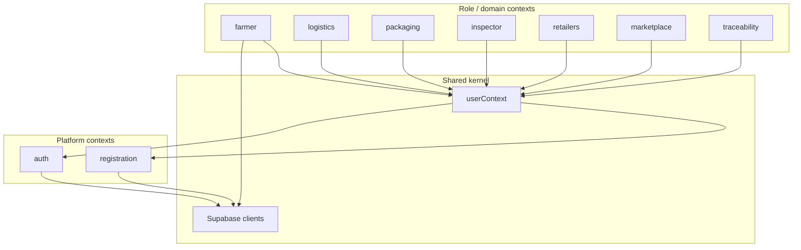

# Bounded context map

**Purpose:** Where each feature lives, what it owns, and which paths are canonical vs legacy.

**Related:** [ADRs](./adr/README.md), [schema-inventory.md](../setup/schema-inventory.md), [auth-adapter-pattern.md](./auth-adapter-pattern.md)

---

## Shared kernel (cross-cutting)

These are not feature folders but glue used by many contexts.

| Piece | Location | Role |
|-------|----------|------|
| **Session / auth state** | `src/contexts/userContext.tsx` | **Canonical** login, logout, register, demo `switchUser` |
| Route guards | `src/components/auth/withAuth.tsx` | Role-based page protection via `useUser()` |
| Supabase browser client | `src/features/registration/services/supabaseClient.ts` | Primary anon client (auth, registration, most reads) |
| Supabase farmer client | `src/features/farmer/services/supabaseClient.ts` | **Duplicate** — causes Multiple GoTrueClient warning; consolidate (Issue #10 D1) |
| Supabase admin | `getSupabaseAdmin()` in registration supabaseClient | Server-only; registration API |
| User types | `src/types/` | `UniversalUser`, roles, normalization |
| Registration enrich | `src/lib/enrichUserFromRegistration.ts` | Post-register profile merge |

---

## Context overview

## Platform Contexts

### Auth

| Folder | `src/features/auth/` |
|--------|----------------------|
| Routes | `/auth/login` (real login), `/login` (demo role picker) |
| Canonical | `userContext` → `RealAuthAdapter`; `/auth/login` page |
| Demo | `/login` → `switchUser()` (React state only) |
| Legacy — do not extend | `HybridAuthAdapter`, `DualAuthService` (demo-only when no Supabase env), LoginService, AuthApplication, `components/services/auth/auth.ts` |
| DB | `users` (via `RealAuthAdapter`) |

### Registration

| Folder | `src/features/registration/` |
|--------|------------------------------|
| Routes | `/get-started`, `/register/*` |
| Canonical | `RegistrationRepository` → `SupabaseRegistrationAdapter`; `POST /api/auth/register` |
| Server helper | `src/lib/server/supabaseRegisterUser.ts` |
| DB | `users`, `_test_connection` |

## Role / domain contexts

Most role dashboards are UI + mock/hooks for demo. Only farmer has a real Supabase adapter today.

| Context | Folder | App route | Data | Notes |
|---------|--------|-----------|------|-------|
| Farmer | `src/features/farmer/` | `/farmer/*` | `farmers` (code only; not in baseline `schema.sql`) | `RealFarmerAdapter`; duplicate supabase client |
| Logistics | `src/features/logistics/` | `/logistics/*` | Mock / local | Hooks + components |
| Packaging | `src/features/packaging/` | `/packaging/*` | Mock / local | Hooks + components |
| Inspector | `src/features/inspector/` | `/inspector/*` | Mock / local | Hooks + components |
| Retailers | `src/features/retailers/` | `/retailer/*` | Mock / local | Hooks + components |
| Marketplace | `src/features/marketplace/` | `/marketplace/*` | Mock / local | Cart hooks, static demo | 
| Traceability | `src/features/traceability/` | `/trace/[id]`, `/public-access/trace/[id]` | Mock / local | Timeline demo |

### Other app routes (no dedicated `features/` folder)

| Route prefix | Purpose | Guard |
|--------------|---------|-------|
| `/intro` | Landing | Public |
| `/government` | Government dashboard | withAuth |
| `/(roles)/saps/*` | SAPS inspections / recovery | Role-specific |
| `/profile` | User profile | useUser() |

## API routes

| Route | Owner | Notes |
|-------|-------|-------|
| `POST /api/auth/register` | Registration | Service role; Auth user + `users` row |
| `GET/PATCH /api/users/[id]/profile` | Auth / users | Profile read/update |
| `GET /api/debug/auth` | — | Dev only (404 in production) |

## Database by context

| Table / storage | Used by | In `schema.sql`? |
|-----------------|---------|------------------|
| `users` | Auth, registration, profile API | Yes |
| `_test_connection` | Diagnostics | Yes |
| `farmers` | Farmer adapter only | Not in baseline |
| `avatars` (Storage) | `src/utils/imageUpload.ts` | Configure in Supabase |
| `profiles`, `user_profiles`, `registration_attempts` | None in current `src/` | Legacy live tables |

See [schema-inventory.md](../setup/schema-inventory.md).

## Canonical vs legacy

| Concern | Use this | Not this |
|---------|----------|----------|
| Login (prod) | `/auth/login` + `userContext.login()` | `HybridAuthPage`, legacy `AuthService` |
| Demo access | `/login` + `switchUser()` | DualAuth when Supabase env is set |
| Logout | `useUser().logout()` | `AuthService.clearToken()` |
| Register | `/api/auth/register` + registration adapters | Mock RegisterForm paths |
| Supabase client | One shared module (target) | Two browser clients today |

Backlog: [Issue #10](https://github.com/lungelomyamya-rgb/maroon_traceability/issues/10).

## Maintenance
When adding a feature folder or route: update this map, note Supabase vs mock data, and link new ADRs if needed.